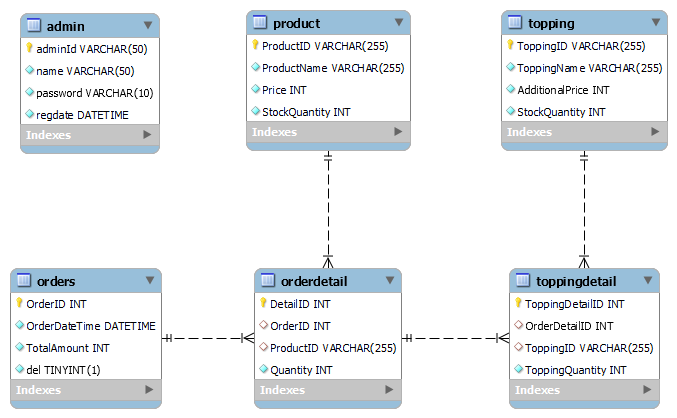

# icecream 1.0
**아이스크림 주문 포스기** 입니다.   

### 개발 기간
* 2023.08.01 ~ 2023.08.15 (약 2주)  

### 개발 환경
* Java 11
* **프레임워크** : Spring5(Maven)
* **데이터베이스** : mysql - jdbcTemplate
* **프론트** : JSP, javascript, jQuery  

### 특징
* 장바구니에 담긴 아이스크림들이 한 줄의 문자열로 보내짐
* 컨트롤러에서 받은 문자열을 다시 분해해서 주문을 생성함(insert)  

### 기능 소개

<b>아이스크림 담기</b>

  

    
  

     * 아이스크림 한 종류와 토핑(0개 또는 여러개)을 선택하고 담기 버튼을 누르면 장바구니에 추가됨
     

<b>주문하기</b>

  

    
  

     * 장바구니에 담긴 아이스크림들이 주문 결정됨

<b>이전 주문 내역</b>

  

    
  

     * 주문 상세 내역이 최신순으로 정렬됨

<b>관리</b>

  

    
  

     * 아이스크림과 토핑 종류 추가

<b>ERD</b>

  

    
  

     * 일대다 관계에 유의하여 구성함
